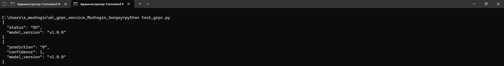

# HW2. Реализация /health и /predict эндпоинтов в gRPC-сервисе
Автор: Можогин Сергей Сергеевич, Науки о данных, 07.12.2025

## Краткое описание проекта
Проект представляет собой **gRPC-сервис** для выполнения предсказаний обученной ML-модели - **RandomForestClassifier**.

Сервис реализует два эндпоинта:
- **/health** — проверка доступности сервиса и версии используемой модели;
- **/predict** — получение предсказания и уверенности по переданным входным признакам.

ML-модель загружается при старте сервиса, а вызовы обрабатываются через **gRPC-контракт**, описанный в **model.proto**.
Сервис контейнеризован с помощью **Docker**. Это обеспечивает его воспроизводимость.

Проект включает клиент для локального тестирования и примеры вызовов обоих методов через скрипт **test_grpc.py**.

## Команды сборки и запуска
```
git clone https://github.com/smozhogin/ml_grpc_service_Mozhogin_Sergey.git # Клонируем репозиторий GitHub
```
```
cd ml_grpc_service_Mozhogin_Sergey # Меняем директорию
```
```
docker build -t ml_grpc_service . # Создаем образ Docker
```
```
docker run -p 50052:50052 ml_grpc_service # Запускаем контейнер Docker на порте 50052
```

## Примеры вызовов /health и /predict
```
python test_grpc.py # Запуск тестов вызовов /health и /predict
```

## Скриншоты вывода команд после запуска контейнера
